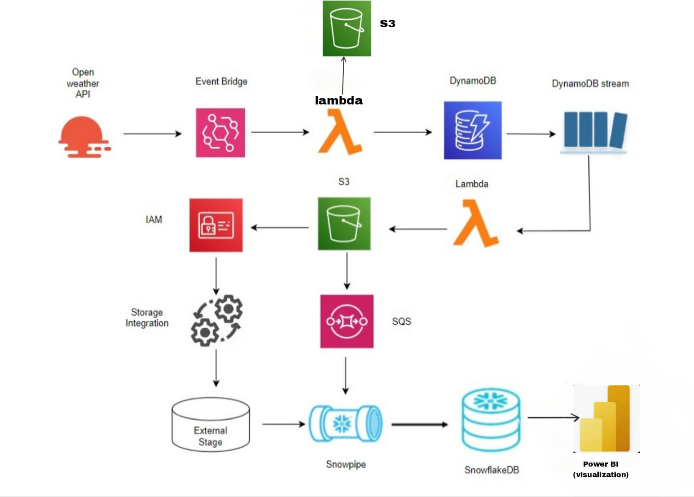

# Weather-Data-API 🌦️

This project collects real-time weather data from OpenWeather API, stores it in AWS DynamoDB and S3, and ingests it into Snowflake using Snowpipe.

## 🔧 Technologies Used
- AWS Lambda
- Amazon S3
- DynamoDB
- Snowflake
- Python
- SQL

## 📊 Architecture

   
## 📁 Files

🔁 Step-by-Step Process

## Data Ingestion Flow

🌤 OpenWeather API → Periodically fetches weather data.

⏰ EventBridge → Triggers Lambda when new data is available.

⚡ Lambda Function → Parses data and writes to dynamodb and s3 bucket.

## Data Processing

🌀 DynamoDB Stream → Detects table changes → Triggers Lambda.

⚡ Lambda (2nd) → Enriches/transforms data → Writes back to S3.

📤  S3 to SQS → Sends alerts to SQS for new files.

## Secure Data Integration

🔐 IAM Roles → Grants secure access to S3 & DynamoDB.

🤝 Storage Integration → Trusted link between AWS & Snowflake.

## Snowflake Integration

❄️ External Stage → Snowflake reads directly from S3.

📥 Snowpipe → Auto-ingests data via SQS notifications.

## Data Visualization

❄️ SnowflakeDB → Stores processed, query-ready data.

📊 Power BI → Pulls data from Snowflake → Generates dashboards & reports.

- `first lambda.py`: Python Lambda code to fetch weather data
- `weather_pipeline_queries.sql`: Data ingestion & transformation queries
- `Taskpowerbi.pbix`: Power BI dashboard file for visualizing weather data
